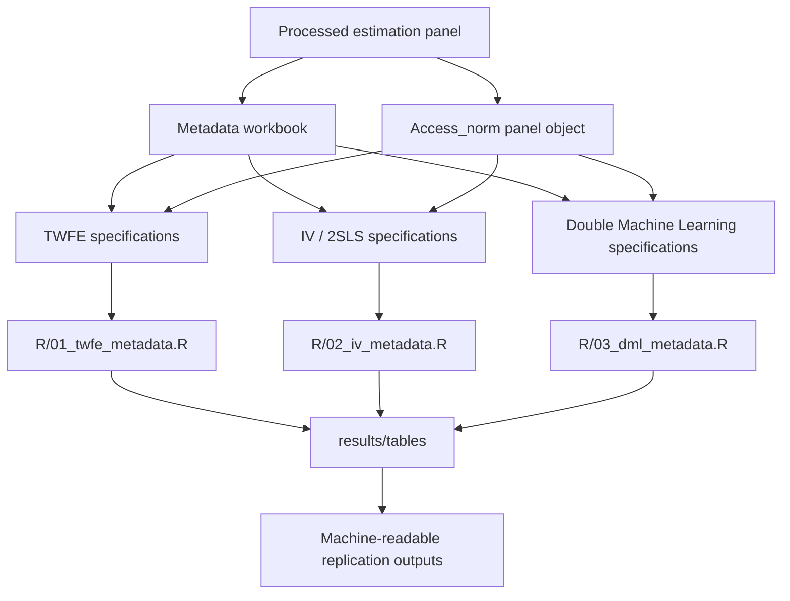

# Fuel Costs and Spatial Rail Accessibility — Replication Package

<p align="center">
  
</p>

Replication material for the paper:

**Fuel Costs and Spatial Rail Accessibility: Econometric Evidence from an Empirically-Weighted Network-Based 3SFCA Model**

Published article: https://www.sciencedirect.com/science/article/pii/S2210539526000994

## Replication workflow



## Repository structure

```text
R/
  00_functions.R
  01_twfe_metadata.R
  02_iv_metadata.R
  03_dml_metadata.R
  99_run_all.R

data/
  processed/
    DB_finale_3SFCA_panel_sample_100rows.RData
    README.md
  metadata/
    Meta_fusco_dm.xlsx

results/
  tables/
```

## Data

The full processed estimation panel is not included because of file-size constraints and data redistribution restrictions.

For the full replication, place this file here:

```text
data/processed/DB_finale_3SFCA_panel.RData
```

The file must contain the R object:

```r
Access_norm
```

## 100-row sample

The repository can include a reduced version of the processed panel:

```text
data/processed/DB_finale_3SFCA_panel_sample_100rows.RData
```

This file should contain **100 rows and all columns** of the final estimation panel.

The sample is useful to verify that scripts, metadata, variable names and package dependencies work. It is not intended to reproduce the published coefficients.

The scripts automatically use the full panel if available. If the full panel is missing, they fall back to the 100-row sample.

## Metadata

The estimation scripts are controlled by:

```text
data/metadata/Meta_fusco_dm.xlsx
```

Expected sheets:

```text
GENERAL   # TWFE specifications
IV        # IV / 2SLS specifications
DBML      # Double / Debiased Machine Learning specifications
```

Expected labels inside the metadata:

```text
dependent_var
independent_vars
control_vars
instrument_vars
interaction
```

## How to run

From the project root:

```r
source("R/99_run_all.R")
```

Or run each block separately:

```r
source("R/01_twfe_metadata.R")
source("R/02_iv_metadata.R")
source("R/03_dml_metadata.R")
```

## Outputs

Outputs are generated in:

```text
results/tables/
```

The repository does not include the final published tables. The article is the official reference for the reported results. The code regenerates machine-readable outputs from the processed panel and metadata.
